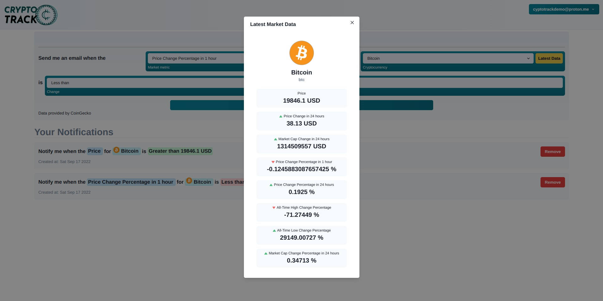

<p align="center">
  <a href="https://github.com/eyuelberga/CryptoTrack">
    
  </a>
</p>

<p align="center">Crypto Track helps you track your Cryptocurrencies and get instant email notification whenever they change.</p>

Cryptocurrency is a volatile asset with lots of ups and downs. Keeping up with the changes can lead to great gains and this tool helps to make this easy. By subscribing to market changes you want to track, CryptoTrack will send you periodic email notifications whenever they change.

## Features

- Track various market data and recieve email notifications
- Manage your notifications
- View the latest market data on a Cryptocurrency

## Tools

- [Courier](https://https://www.courier.com/): Sending email notifications
- [Supabase](https://supabase.com/): Authentication and Database Storage
- [CoinGecko](https://www.coingecko.com/): Latest Cryptocurrency market data API
- [Vite + React](https://vitejs.dev/) : Frontend web application
- [Express](https://expressjs.com/) + [Vercel](https://vercel.com/): Webhook for cron job


## Preview 




## Development

### Web

#### Installation


```bash
$  cd web
```

```bash
$  yarn
```

#### Running the app

```bash

$ yarn dev
```

#### Environment variables

```
VITE_SUPABASE_URL=
VITE_SUPABASE_KEY=

```


### Cron Webhook

#### Installation


```bash
$  cd cron
```

```bash
$  yarn
```

#### Running the app

```bash

$ yarn start
```

#### Environment variables

```
SUPABASE_URL=
SUPABASE_KEY=
COURIER_KEY=

```

## License

MIT © [Eyuel Berga Woldemichael](https://github.com/eyuelberga)
